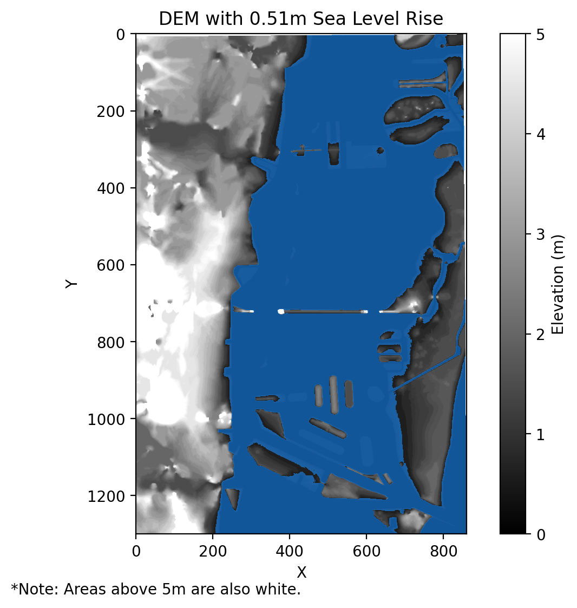
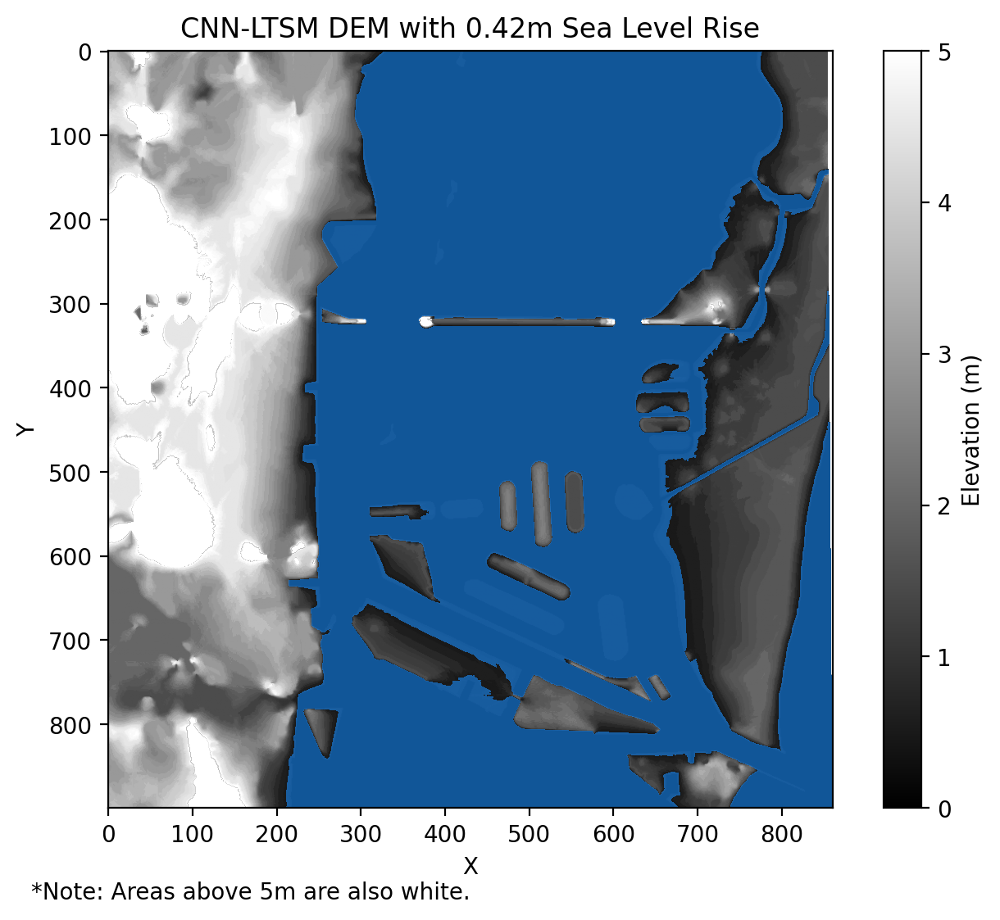
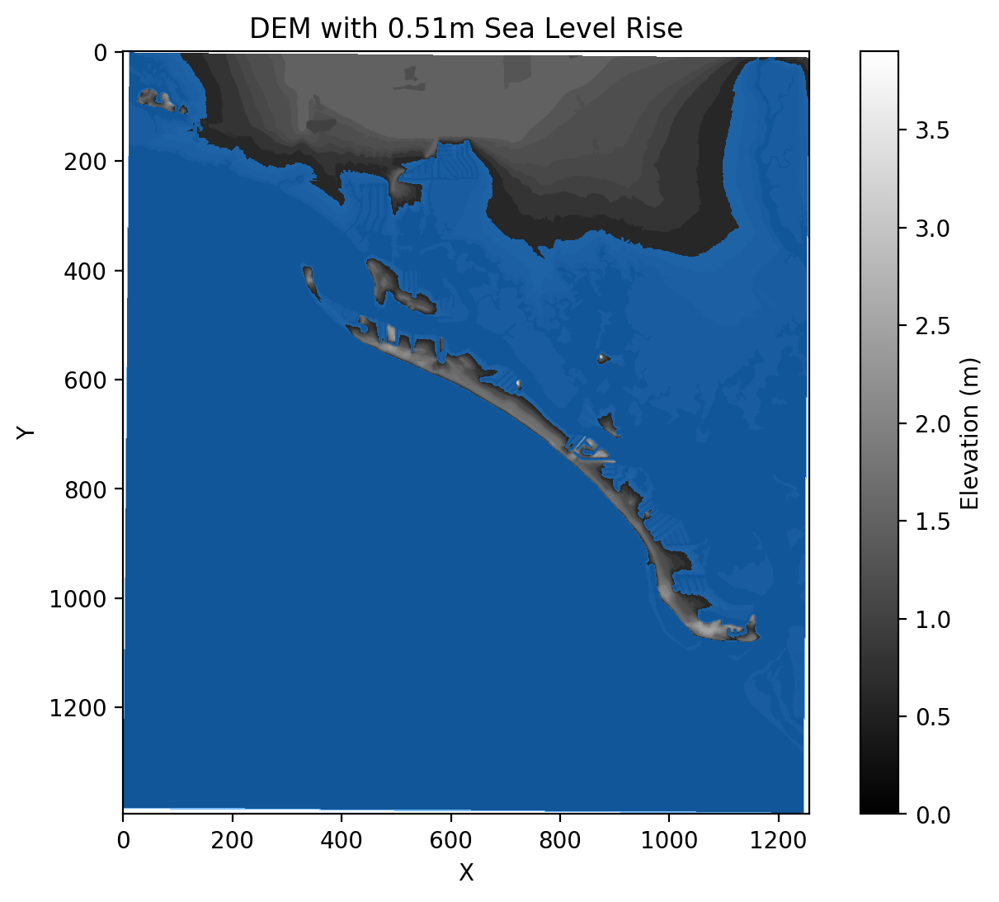
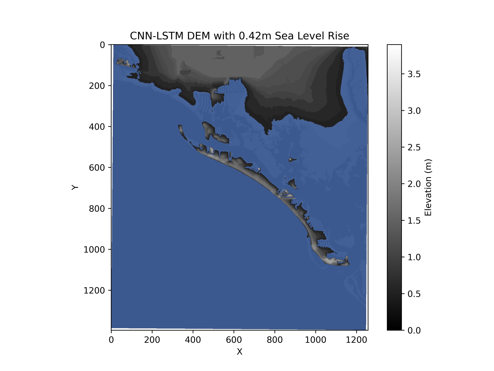
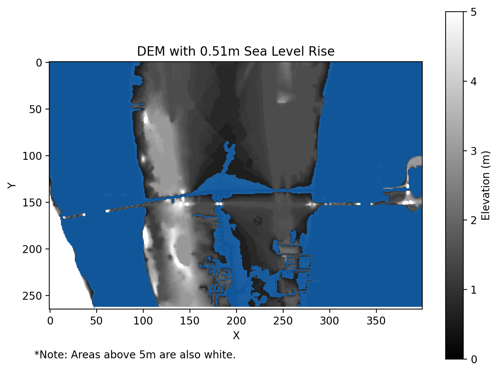
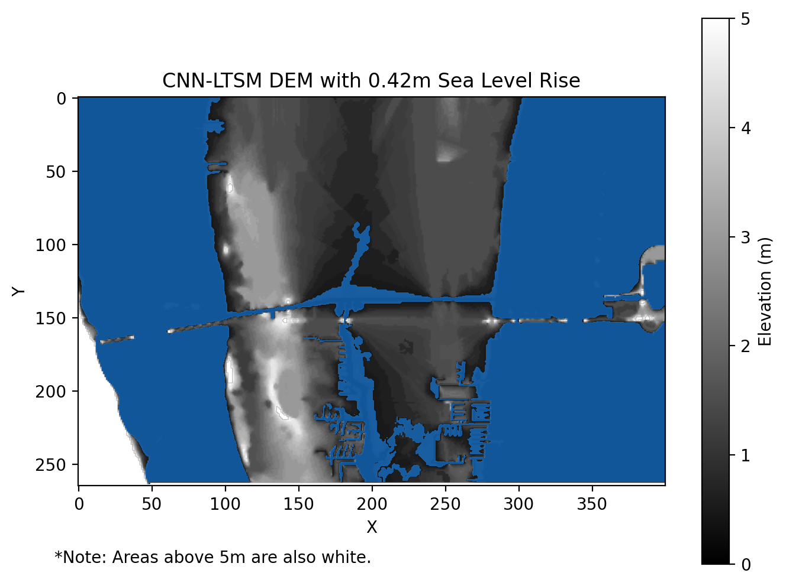
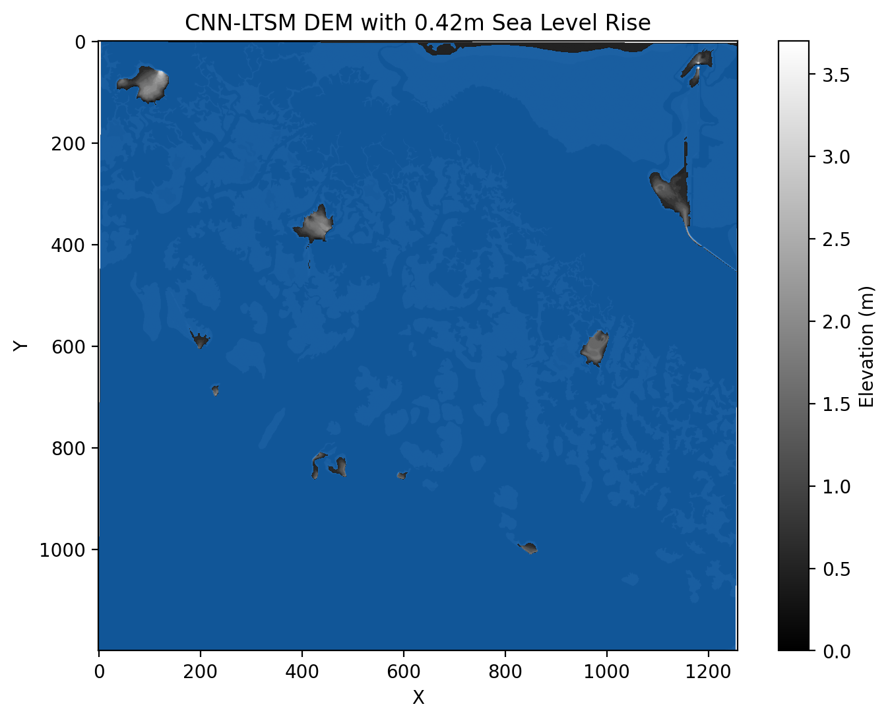

## Figure 1:

Our first figure is one of our temperature prediction using the pattern scaling (linear) emulator. We can see it does a good job predicting sea level rise. This follows the paper "A Semi-Empirical Approach to Projecting Future Sea-Level Rise" ([Rahmstorf 2007](https://www.pik-potsdam.de/~stefan/Publications/Nature/rahmstorf_science_2007.pdf)).

<iframe src="https://zoeludena.github.io/SeeRiseWebsite/assets/figures/tas_predict_vs_historical.html" width="100%" style="aspect-ratio: 4 / 3; border: 0;"></iframe>

## Figure 2:

Our second figure is using the pattern scaling (linear) emulator seen in Figure 1 to predict the different Shared Socioeconomic Pathways (SSPs).

<iframe src="https://zoeludena.github.io/SeeRiseWebsite/assets/figures/tas_preds_ssps.html" width="100%" style="aspect-ratio: 4 / 3; border: 0;"></iframe>

## Figure 3: 

Our third figure plots the NASA projection and uncertainty window, their [Sea Level projection Tool](https://sealevel.nasa.gov/ipcc-ar6-sea-level-projection-tool?type=global). Seen below are the median see level rise predicted every ten years. The shaded ranges show the 17th-83rd percentile ranges for NASA's prediction. The shaded region is based off of a bunch of models that capture a range of uncertainty.

<iframe src="https://zoeludena.github.io/SeeRiseWebsite/assets/figures/nasa_slr_projection.html" width="100%" style="aspect-ratio: 4 / 3; border: 0;"></iframe>

## Figure 4:

Our fourth figure uses three other emulators and plots alongside an adjusted NASA value (from 2015-2100). We can see the neural network, gaussian processing model, and random forest model perform slightly different than pattern scaling, but still follow the general expected trend. These values were generated using SSP 254's values for 2015-2100. You can see we are overpredicting, which is typical with the Rahmstorf model.

<iframe src="https://zoeludena.github.io/SeeRiseWebsite/assets/figures/ssp245_emulator_preds.html" width="100%" style="aspect-ratio: 4 / 3; border: 0;"></iframe>

## Figure 5:

Our fifth figure plots the NASA projection for SSP 245 and the emulators while keeping greenhouse gases constant at 2025 levels. We can see that we are on the lower range of uncertainty for NASA's prediction. The emulator that performs the best appears to be pattern scaling. This is what our app and research is based on.

<iframe src="https://zoeludena.github.io/SeeRiseWebsite/assets/figures/2025_fixed_emulator_preds.html" width="100%" style="aspect-ratio: 4 / 3; border: 0;"></iframe>

## Figure 6:

Our sixth figure plots the pattern scaling emulator's uncertainty and median prediction assuming there will be 4520 gigatons of cumulative carbon dioxide in 2100 (according to SSP 245). The expected line is a modified NASA's sea level rise median prediction. The modification is changing the sea level rise to account from 2015 to 2100.

<iframe src="https://zoeludena.github.io/SeeRiseWebsite/assets/figures/2025_fixed_ps_preds.html" width="100%" style="aspect-ratio: 4 / 3; border: 0;"></iframe>

## Figure 7:

Our seventh figure plots the random forest emulator's uncertainty and median prediction assuming there will be 4520 gigatons of cumulative carbon dioxide in 2100 (according to SSP 245). The expected line is a modified NASA's sea level rise median prediction. The modification is changing the sea level rise to account from 2015 to 2100.

<iframe src="https://zoeludena.github.io/SeeRiseWebsite/assets/figures/2025_fixed_rf_preds.html" width="100%" style="aspect-ratio: 4 / 3; border: 0;"></iframe>

## Figure 8:

Our eighth figure plots the gaussian process emulator's uncertainty and median prediction assuming there will be 4520 gigatons of cumulative carbon dioxide in 2100 (according to SSP 245). The expected line is a modified NASA's sea level rise median prediction. The modification is changing the sea level rise to account from 2015 to 2100.

<iframe src="https://zoeludena.github.io/SeeRiseWebsite/assets/figures/2025_fixed_gp_preds.html" width="100%" style="aspect-ratio: 4 / 3; border: 0;"></iframe>

## Figure 9:

Our ninth figure plots the CNN-LTSM emulator's uncertainty and median prediction assuming there will be 4520 gigatons of cumulative carbon dioxide in 2100 (according to SSP 245). The expected line is a modified NASA's sea level rise median prediction. The modification is changing the sea level rise to account from 2015 to 2100.

<iframe src="https://zoeludena.github.io/SeeRiseWebsite/assets/figures/2025_fixed_cnn_preds.html" width="100%" style="aspect-ratio: 4 / 3; border: 0;"></iframe>

## Figure 10:

Here are screenshots of the boxplots for sea level rise when cumulative carbon dioxide is at 4520 gigatons in 2100.

   
   
   
   

## Figure 11:

Here are screenshots of our visualization of Miami. Recall the median sea level rise with cumulative carbon dioxide at 4520 gigatons is the same for the pattern scaling, random forest, and gaussian process emulators.

 
 

## Figure 12:

Here are screenshots of our visualization of Fort Myers Beach. Recall the median sea level rise with cumulative carbon dioxide at 4520 gigatons is the same for the pattern scaling, random forest, and gaussian process emulators.

 
 

## Figure 13:

Here are screenshots of our visualization of Audubon/Merrit Island. This is the space between Audubon and Merrit Island. Recall the median sea level rise with cumulative carbon dioxide at 4520 gigatons is the same for the pattern scaling, random forest, and gaussian process emulators.

 
 

## Figure 14:

Here are screenshots of our visualization of Everglades City. Recall the median sea level rise with cumulative carbon dioxide at 4520 gigatons is the same for the pattern scaling, random forest, and gaussian process emulators.

 
 

