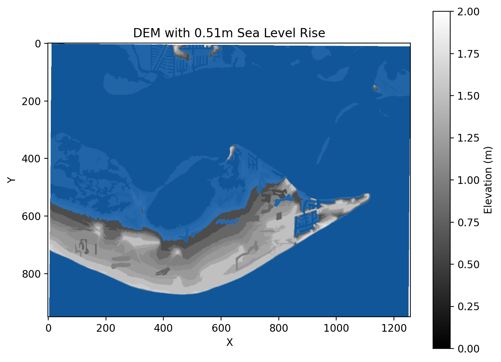
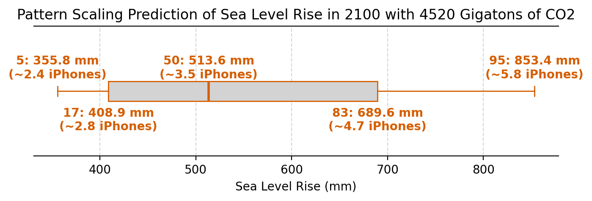
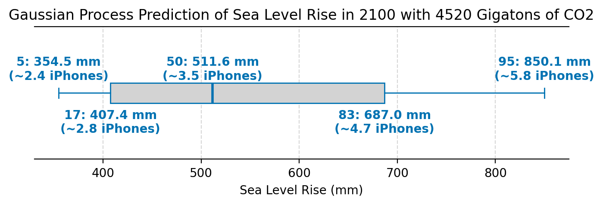
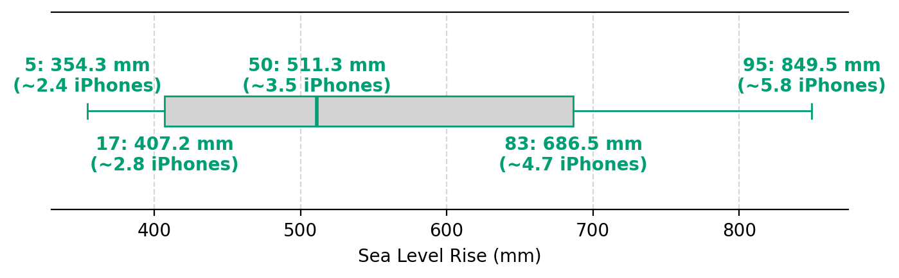
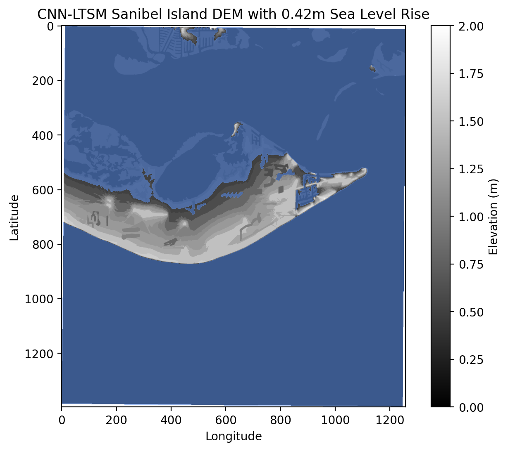
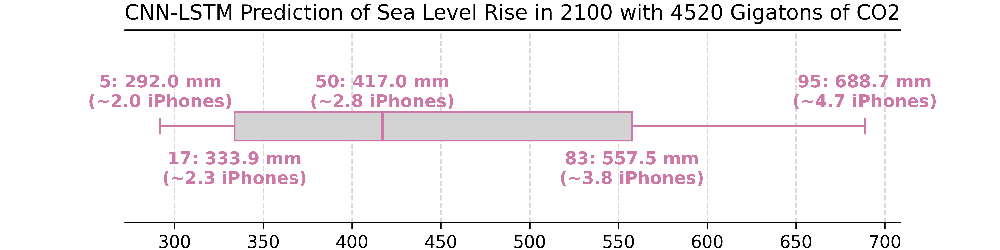

# Visualizing Emulated Sea Level Rise on Coastal Regions

    <a href="https://github.com/zoeludena/SeeRise" target="_blank">
        <button style="background-color: #6C7A89; color: white; border: none; padding: 10px 20px; 
                    border-radius: 8px; font-size: 16px; cursor: pointer; transition: 0.3s; 
                    box-shadow: 2px 2px 5px rgba(0, 0, 0, 0.2);"
                onmouseover="this.style.backgroundColor='#5A6978'; this.style.transform='scale(1.05)';" 
                onmouseout="this.style.backgroundColor='#6C7A89'; this.style.transform='scale(1)';"
                onmousedown="this.style.backgroundColor='#485563'; this.style.transform='scale(0.95)';"
                onmouseup="this.style.backgroundColor='#5A6978'; this.style.transform='scale(1.05)';">
            💽GitHub/Code
        </button>
    </a>

<a href="https://zoeludena.github.io/SeeRiseWebsite/assets/SeeRise_Paper.pdf" target="_blank">
    <button style="background-color: #3498db; color: white; border: none; padding: 10px 20px; 
                border-radius: 8px; font-size: 16px; cursor: pointer; transition: 0.3s; 
                box-shadow: 2px 2px 5px rgba(0, 0, 0, 0.2);"
            onmouseover="this.style.backgroundColor='#2980b9'; this.style.transform='scale(1.05)';" 
            onmouseout="this.style.backgroundColor='#3498db'; this.style.transform='scale(1)';"
            onmousedown="this.style.backgroundColor='#1f669a'; this.style.transform='scale(0.95)';"
            onmouseup="this.style.backgroundColor='#2980b9'; this.style.transform='scale(1.05)';">
        📃Research Paper
    </button>
</a>

<a href="https://zoeludena.github.io/SeeRiseWebsite/assets/SeeRise_Poster.pdf" target="_blank">
    <button style="background-color: #6C7A89; color: white; border: none; padding: 10px 20px; 
                    border-radius: 8px; font-size: 16px; cursor: pointer; transition: 0.3s; 
                    box-shadow: 2px 2px 5px rgba(0, 0, 0, 0.2);"
                onmouseover="this.style.backgroundColor='#5A6978'; this.style.transform='scale(1.05)';" 
                onmouseout="this.style.backgroundColor='#6C7A89'; this.style.transform='scale(1)';"
                onmousedown="this.style.backgroundColor='#485563'; this.style.transform='scale(0.95)';"
                onmouseup="this.style.backgroundColor='#5A6978'; this.style.transform='scale(1.05)';">
        🪧Poster
    </button>
</a>

 

## Our Inspiration

The advent of sea level rise can have devastating consequences on coastal areas all around the world.  Low-lying regions—such as Florida, a state particularly susceptible to sea level rise due to its low-lying topography and extensive coastline—are especially a major focal point when it comes to modeling sea level rise as they are most vulnerable to changes. Using the method described by "A Semi-Empirical Approach to Projecting Future Sea-Level Rise" ([Rahmstorf 2007](https://www.pik-potsdam.de/~stefan/Publications/Nature/rahmstorf_science_2007.pdf)), which regresses the rate of sea level rise on surface air temperature anomaly, our team coupled this model with emulators from the “ClimateBench v1.0: A Benchmark for Data-Driven Climate Projections” ([Watson-Parris et al. 2022](https://agupubs.onlinelibrary.wiley.com/doi/10.1029/2021MS002954)) to create a predictor capable of simulating sea level rise in any future emission scenario, not just the ones prescribed by Shared Socioeconomic Pathways. This impact is then visualized using high-resolution topography data to assess the potential transformation of Florida’s coastal landscape, which can aid policymakers in developing mitigation and adaptation strategies.

## Methods

### Climate Model Emulators

  
What is a Shared Socioeconomic Pathway (SSP)?

  SSPs are scenarios used in climate research to describe different ways society might develop in the future. So... what affects greenhouse gas emissions and how vulnerable are we to climate change? They're narratives that combine social, economic, and technological trends without including the climate policies themselves — policies are added on top of SSPs in modeling.

  They're commonly used with climate models to predict possible futures for things like: Global temperature rise, sea level rise, extreme weather, and economic and social impacts.

  The SSPs we talk about are:

  - **SSP 126 "Taking the Green Road"**: There is an emphasis on human well-being, driven by an increasing commitment to achieve development goals. There is lower material growth and lower resource and energy intensity.
  - **SSP 245 "Middle of the Road"**: Social, economic, and technological trends do not shift much from historical patterns. Environmental systems experience some degradation and the intensity of resource and energy use declines.
  - **SSP 370 "A Rocky Road"**: Policies shift to become increasingly oriented toward national and regional security issues. Countries focus on achieving their personal goals within their regions. Consumption is material-intensive and there is a low priority for addressing environmental concerns.
  - **SSP 585 "Taking the Highway"**: World places faith in competitive markets, innovation, and participatory societies to produce technological progress to create a sustainable future. Push for economic and social development is coupled with the exploitation of fossil fuel resources.

Our first objective was to tune the hyperparameter for each emulator model. The emulators are fitted to historical data and each SSP, excluding SSP 245 which is used for validation. The emulators take in any combination of greenhouse gas emissions as input, but in order to assure ourselves that the outputs are sensible, we used the prescribed emissions for the SSP scenarios for training and validation. The emulators are used to predict surface air temperature based on difference emission inputs, and we later use the predicted temperature as the input to our sea level model.

We used four different emulators based on what we learned in the ClimateBench and our previous research, [ResearchOnClimate](https://github.com/zoeludena/ResearchOnClimate/blob/main/Utilizing_Emulators_to_Explore_the_Climate_Model_Parameter_Space.pdf). We used a Pattern Scaling emulator, a Gaussian Process emulator, a Random Forest emulator, and a CNN-LTSM emulator.

  
Learn about our emulators:

1. We used a Pattern Scaling emulator. In the Rahmstorf paper they use linear regression trained on historical temperature and the difference between the predicted temperature and the average. This makes our pattern scaling emulator a fantastic one-to-one comparison.
2. We used a Gaussian Process emulator. Climate systems are governed by complex, smooth, and highly nonlinear relationships, making Gaussian Process (GP) emulators well-suited for predicting future climate scenarios. Building on our previous research, we chose to utilize the original GP model from ClimateBench as a foundation for our work. This approach leverages the flexibility and uncertainty quantification capabilities of GPs to improve climate predictions.
3. We used a Random Forest emulator. While decision trees capture non-linear relationships well, they tend to overfit. Random Forest mitigates this by averaging predictions, reducing variance, and enhancing robustness. This makes it ideal for climate model emulation, where multiple target variables require separate models.
4. We used a CNN-LTSM emulator. Neural networks excel at climate prediction due to their ability to model complex, non-linear relationships between atmospheric variables. Their deep architectures enable them to learn patterns from large-scale climate data, capturing intricate dependencies that traditional models may overlook. Their adaptability also allows them to generalize well across different climate scenarios, making them valuable for long-term forecasting and extreme weather prediction.

Given a final $\text{CO}_2$ concentration 2100, we interpolated the trajectory of atmospheric $\text{CO}_2$ concentration by linearly increasing/decreasing the carbon dioxide amount from 2015 to 2100, assuming equal step every year, to predict the yearly surface air temperatures. Linear interpolation was chosen because it does not assume overly complicated models and is applicable given any valid 2100 $\text{CO}_2$ concentration. The predicted series of temperatures was then used as an input for our sea level model.

### Sea Level Rise Projection

Using the model described by Rahmstorf (2007), we then produce a linear fit for change in sea level height, regressed on temperature anomaly (temperature difference from a baseline). We take our surface air temperature variable from each of the emulator output files and then use it to train the model on predicted sea level rise in the NOR-ESM2 model for each SSP scenario.

Mathematically, the model equation is of the form:

$$
\frac{dH}{dt} = a(T - T_0)
$$

where  $\frac{dH}{dt}$ is change in sea level height per year, \\(a\\) is a proportionality constant, and \\(T - T_0\\) is temperature relative to a baseline. Finally, to get the total sea level rise, we integrate the rate of sea level rise \\(\frac{dH}{dt}\\) to obtain the total height at the final year of recorded temperature:

$$
H(t) = \int_{t_0}^{t} \frac{dH}{dt} dt.
$$

Finally, as a simple sanity check, we compare visually and quantitatively the predicted sea level rise against both historical satellite data and other projections of sea level rise (NASA).

**Comparing Projections of Sea Level Rise with Historical**

<iframe src="https://zoeludena.github.io/SeeRiseWebsite/assets/figures/tas_predict_vs_historical.html" width="100%" style="aspect-ratio: 4 / 3; border: 0;"></iframe>

## Results

### Predicted Sea Level Rise

For this paper, we compare our median predictions to the expected sea level rise under SSP 245. According to [NASA projections](https://sealevel.nasa.gov/ipcc-ar6-sea-level-projection-tool?type=global), the expected cumulative rise in sea level under SSP 245 between 2015 and 2100 will be 536.4 mm (± about 158 mm for the 66% confidence interval) ---about the width a large pizza box. 

Since our sea level rise model requires a trajectory of TAS, thus a trajectory of $\text{CO}_2$ concentrations for predicting TAS using the emulators, we took the 2100 $\text{CO}_2$ concentration under SSP 245, around 4520 Gigatons, to linearly interpolate the trajectory from 2015 to 2100.

**Prediction Error Comparison**

| Emulator         | Predicted (mm) | NASA Predicted - Emulator Predicted (mm) |
|-----------------|---------------|------------------------|
| Pattern Scaling | 513.6         | 22.8                   |
| Gaussian Process | 511.6         | 24.8                   |
| Random Forest   | 511.3         | 25.1                   |
| CNN-LSTM        | 417.0         | 119.4                  |

**Comparing Emulators with NASA Keeping Greenhouse Gases Fixed at 2025**

<iframe src="https://zoeludena.github.io/SeeRiseWebsite/assets/figures/2025_fixed_emulator_preds.html" width="100%" style="aspect-ratio: 4 / 3; border: 0;"></iframe>

As we can see from Figure \ref{fig:2025_fixed_emulator_preds}, the Pattern Scaling, Gaussian Process, and Random Forest emulators perform about equally well when compared to the expected sea level rise. Looking at Table \ref{tab:prediction_comparison}, they are under-predicting by about the size of a peanut 🥜 (20 mm) or an inch (25 mm). The CNN-LTSM model performs the worst. The measurement is off from the expected value by about a standard playing card's length 🃏 (120 mm).

### Florida Sea Level Rise

Florida is a state particularly susceptible to sea level rise due to its low-lying topography and extensive coastline. To visualize the rise in sea level and its impact on Florida, we made use of digital elevation models (DEM). DEMs are a representation of the bare ground topographic surface of the Earth, excluding trees, buildings, and any other surface objects. To generate DEMs, LiDAR data (essentially 3D scans of the Earth's surface) is taken and processed using algorithms,  supplemented with other data sources, to construct the true elevation of the land surface.

For visualizing the topography of Florida, corresponding to different sea level rise amounts, we chose the following coastal locations: Sanibel Island, Miami, Fort Myers Beach, the space in between Audubon and Merritt Island, and Everglades City.

Given an emission scenario and the temperature projections, we took the median of predicted sea level rise in the year 2100 and determined how much of the land would be submerged. For this paper, we focus on SSP 245 and use the concentration of carbon dioxide in 2100, which is about 4520 Gigatons, as the input.

  

  
Click for Greenhouse Gas Values in 2025 (SSP 245)

  We performed Empirical Orthogonal Function (EOF) decomposition on Black Carbon (BC) and Sulfur Dioxide ($\text{SO}_2$). Methane (CH₄) is normalized where the maximum amount of methane is $0.8$. Principal component time series are extracted to create five BC and $\text{SO}_2$ columns, each corresponding to one EOF mode's time series. The unit for the principal component BC and $\text{SO}_2$ is Tg/year (teragrams per year).

  

| Component               | Value     |
|-------------------------|----------|
| CH₄                    | 0.474023  |
| pseudo_pcs, BC_0       | 1.747441  |
| pseudo_pcs, BC_1       | 1.498689  |
| pseudo_pcs, BC_2       | -0.807297 |
| pseudo_pcs, BC_3       | 3.507481  |
| pseudo_pcs, BC_4       | 1.282007  |
| pseudo_pcs, SO2_0      | 1.087772  |
| pseudo_pcs, SO2_1      | 1.462824  |
| pseudo_pcs, SO2_2      | 1.427859  |
| pseudo_pcs, SO2_3      | 1.940259  |
| pseudo_pcs, SO2_4      | -1.740802 |

  

  Pattern Scaling, Gaussian Process, and Random Forest all have around the same median sea level rise (~0.5 meters). Their visualizations of Sanibel Island are the same!

  

     
  

  

  

  
Click for Pattern Scaling Boxplot

  

      
  

  

  

  
Click for Gaussian Process Boxplot

  

      
  

  

  

  
Click for Random Forest Boxplot

  

      
  

  

  The CNN-LTSM performed worse compared to the other three emulators and produced a different prediction:

  

     
  

  

  
Click for CNN-LTSM Boxplot

  

      
  

  

In our visualizations we took the median amount of sea level rise and determined how much land would be submerged. For this paper we used the cumulative amount of carbon dioxide in 2100 for SSP 245, which is about 4520 Gigatons of carbon dioxide.

You can visualize interactive changes on our [application](https://zoeludena.github.io/SeeRiseWebsite/app/) or look at [figures](https://zoeludena.github.io/SeeRiseWebsite/figures/). Inside of our application you can also visualize other DEM files!

## Discussion

Similar to past work, our sea level rise model using Rahmstorf’s approach is prone to over-predicting when evaluated against the true expected projections. The model assumes a near-linear relationship between temperature and sea level rise rate, based on 20th-century observations. However, it is important to note that real-world ice sheet dynamics may not respond linearly to temperature changes, which can affect the true rate of sea level rise in the future. 

On the other hand, our model suffers from under-prediction when only changing $\text{CO}_2$ year to year and keeping the other greenhouse gases constant. Future work can be done on scaling all other greenhouse gases input appropriately, which would likely produce more accurate temperature values and sea level rise predictions.

## Conclusion

Inspired by the issue of sea level rise due to global warming, we worked on modeling projected sea level rise for the future up until 2100, and made use of climate model emulators as a first step for temperature inputs into the sea level projection model. The sea level rise projection model follows a semi-empirical differential equation approach from Rahmstorf, in which we fitted a linear model and obtained a rate of sea level change, then integrated to get the total sea level rise. We also explored the impact of sea level rise on one particularly vulnerable region, Florida, by utilizing DEM data and visualizing the change in local topography and coastline following different amounts of sea level rise. 

Overall, our work demonstrated the effectiveness of using machine learning and statistical models alongside the Rahmstorf differential equation approach to achieve fairly sound results in predicting temperature and sea level rise. The interactive visualizations were created in the hope to make understanding the impacts of sea level rise more intuitive and accessible for potential audiences and to raise further awareness of the issue of global warming and sea level rise.

